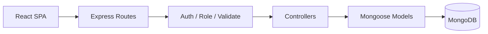

# ClinicSync

**ClinicSync** is a high-fidelity clinic management platform that helps healthcare teams schedule visits, coordinate clinicians, and run day-to-day operations from one calm, role-aware workspace.


---

## Table of contents

- [Features](#features)
- [Tech stack](#tech-stack)
- [Project structure](#project-structure)
- [Architecture](#architecture)
- [Getting started](#getting-started)
- [Environment variables](#environment-variables)
- [Available scripts](#available-scripts)
- [Demo accounts](#demo-accounts)
- [API overview](#api-overview)
- [Screenshots](#screenshots)
- [Deployment](#deployment)
- [License](#license)

---

## Features

### Clinical operations

| Capability | Description |
|------------|-------------|
| **Role-based portals** | Separate sign-in flows for **patients**, **doctors**, and **admins** (`/login/patient`, `/login/doctor`, `/login/admin`). |
| **Patient dashboard** | Personalized overview with upcoming and past appointments, plus quick links to book care. |
| **Appointment scheduling** | Patients book by doctor, date, and open slot; doctors and admins approve, complete, or cancel visits. |
| **Doctor directory** | Browse a fixed roster of clinicians filtered to **available** doctors (weekly hours + open slots). |
| **Doctor profiles** | Specialty, experience, bio, and weekly availability per clinician. |
| **Patient records** | Admins and doctors view patient profiles and medical notes. |
| **Admin registry** | Manage the five-doctor roster, schedules, and credentials. |
| **Operations dashboard** | Role-specific KPIs (pending approvals, today’s visits, totals). |

### Experience & interface

| Capability | Description |
|------------|-------------|
| **Minimalist SaaS aesthetic** | Monochrome-forward palette (black, white, gray) with Poppins typography and soft elevation. |
| **Physical transitions** | `tailwindcss-animate` and Radix primitives for menus, dialogs, and sheets that feel tactile—not flat. |
| **Typewriter landing** | Marketing hero designed for typewriter-style headline animation and progressive disclosure on the public landing page. |
| **Clinic Assistant** | Robot-themed AI concierge with a live **online** status indicator for patient guidance (dashboard shell). |
| **Dark mode** | System-aware theme toggle across the authenticated app shell. |
| **Quick-fill sign-in** | Per-portal demo shortcuts on login screens for local development and demos. |

---

## Tech stack

| Layer | Technologies |
|-------|----------------|
| **Frontend** | React 19, TypeScript, Vite 8, React Router 7, Tailwind CSS 3, [shadcn/ui](https://ui.shadcn.com)-style Radix components, Axios, date-fns, Lucide icons |
| **Backend** | Node.js, Express 5, Mongoose 9, JWT, bcryptjs, express-validator |
| **Database** | MongoDB |
| **Tooling** | ESLint, PostCSS, Autoprefixer, Nodemon (API dev) |

---

## Project structure

The repository is a **monorepo** with two applications:

```
Hospital/
├── frontend/                 # React SPA (Vite)
│   ├── public/
│   ├── src/
│   │   ├── api/              # Axios client
│   │   ├── components/
│   │   │   ├── layout/       # App shell, sidebar
│   │   │   └── ui/           # shadcn-style primitives
│   │   ├── contexts/         # Auth, theme
│   │   ├── data/             # Clinical directory, demo accounts
│   │   ├── hooks/
│   │   ├── lib/              # cn(), portal helpers
│   │   ├── pages/            # Route-level views
│   │   └── services/         # API wrappers (e.g. doctors)
│   ├── index.html
│   ├── vite.config.ts
│   └── package.json
│
├── backend/                  # Express API
│   ├── src/
│   │   ├── config/           # MongoDB connection
│   │   ├── controllers/      # Request handlers (MVC)
│   │   ├── middleware/       # Auth, roles, validation, errors
│   │   ├── models/           # Mongoose schemas
│   │   ├── routes/           # Route definitions
│   │   ├── utils/            # JWT, slot generation
│   │   ├── app.js            # Express app + middleware
│   │   ├── server.js         # HTTP entry + bootstrap
│   │   ├── seed.js           # Full database seed
│   │   ├── bootstrapDemo.js  # Dev admin + doctor roster sync
│   │   └── demoAccounts.js   # Shared demo doctor roster
│   ├── seedDoctors.js        # Replace doctor roster only
│   ├── .env.example
│   └── package.json
│
└── README.md
```

> **Note:** Paths above match this repo (`frontend/` + `backend/`). If you alias them as **client** and **server**, they map 1:1 to those folders.

---

## Architecture

### Backend — Express MVC

The API follows a classic **Model–View–Controller** layout (JSON responses instead of server-rendered views):



| Layer | Responsibility | Examples |
|-------|----------------|----------|
| **Routes** | HTTP paths, validators | `authRoutes.js`, `doctorRoutes.js`, `appointmentRoutes.js` |
| **Controllers** | Business logic | `authController.js`, `doctorController.js`, `appointmentController.js` |
| **Models** | Persistence | `User`, `Doctor`, `Patient`, `Appointment` |
| **Middleware** | Cross-cutting concerns | `auth.js`, `role.js`, `validateRequest.js`, `errorHandler.js` |
| **Utils** | Pure helpers | `slots.js` (availability windows), `jwt.js` |

**Auth model:** JWT bearer tokens; roles are `admin`, `doctor`, and `patient`. Protected routes use `authenticate` + `authorize(...)`.

**Doctor roster:** Five fixed demo clinicians with individual logins; list endpoints support `availableOnly` and `date` filters so only bookable doctors appear to patients.

### Frontend — React + shadcn-style UI

| Area | Pattern |
|------|---------|
| **Routing** | `react-router-dom` with public routes, guest routes, and `/app/*` protected layout |
| **State** | `AuthContext` (session), `ThemeContext` (light/dark) |
| **UI** | Composable primitives under `src/components/ui/` (Button, Card, Dialog, Select, Calendar, Table, Toast, …) built on Radix + `class-variance-authority` + Tailwind |
| **API** | `src/api/client.ts` — dev proxy to `http://localhost:5000/api` via Vite; production uses `VITE_API_URL` |
| **Pages** | One file per major screen under `src/pages/` |

---

## Getting started

### Prerequisites

- **Node.js** 18+ (20+ recommended)
- **npm** 9+
- **MongoDB** 6+ (local or [MongoDB Atlas](https://www.mongodb.com/atlas))

### 1. Clone and install

```bash
git clone <your-repo-url>
cd Hospital

# Backend
cd backend
npm install
cp .env.example .env
# Edit .env — set MONGODB_URI and JWT_SECRET

# Frontend
cd ../frontend
npm install
```

### 2. Configure environment

See [Environment variables](#environment-variables). At minimum, set `MONGODB_URI` and `JWT_SECRET` in `backend/.env`.

Optional frontend file `frontend/.env` for production API URL:

```env
VITE_API_URL=https://your-api.example.com/api
```

### 3. Seed the database

From `backend/`:

```bash
npm run seed
```

This creates demo admin, five doctors (each with login), patients, and sample appointments.

### 4. Run locally

**Terminal A — API** (`backend/`):

```bash
npm run dev
```

API listens on **http://localhost:5000** (default). Health check: `GET http://localhost:5000/api/health`.

**Terminal B — Web** (`frontend/`):

```bash
npm run dev
```

App runs at **http://localhost:5173**. Vite proxies `/api` → `http://localhost:5000`.

---

## Environment variables

### Backend (`backend/.env`)

| Variable | Required | Description |
|----------|----------|-------------|
| `PORT` | No | API port (default `5000`) |
| `MONGODB_URI` | **Yes** | MongoDB connection string |
| `JWT_SECRET` | **Yes** | Secret for signing tokens |
| `JWT_EXPIRES_IN` | No | Token TTL (default `7d`) |
| `CLIENT_URL` | No | Allowed CORS origin(s), comma-separated |
| `BOOTSTRAP_DEMO_ADMIN` | No | Set `true` to auto-create demo admin in production |
| `BOOTSTRAP_DEMO_DOCTORS` | No | Set `true` to sync five-doctor roster in production |

### Frontend (`frontend/.env`)

| Variable | Required | Description |
|----------|----------|-------------|
| `VITE_API_URL` | Production | Full API base URL, e.g. `https://api.example.com/api`. Omit in dev to use Vite proxy. |

---

## Available scripts

### Backend (`backend/`)

| Script | Command | Description |
|--------|---------|-------------|
| Dev | `npm run dev` | Start API with Nodemon |
| Start | `npm start` | Production start |
| Seed | `npm run seed` | Reset DB + full demo data |
| Doctors only | `npm run seed:doctors` | Replace doctor roster (keeps other users) |

### Frontend (`frontend/`)

| Script | Command | Description |
|--------|---------|-------------|
| Dev | `npm run dev` | Vite dev server |
| Build | `npm run build` | Typecheck + production bundle → `dist/` |
| Preview | `npm run preview` | Serve production build locally |
| Lint | `npm run lint` | ESLint |

---

## Demo accounts

After `npm run seed` in `backend/`:

| Role | Email | Password |
|------|-------|----------|
| Admin | `admin@clinicsync.com` | `Admin123!` |
| Patient | `alex@clinicsync.com` | `Patient123!` |
| Patient | `jordan@clinicsync.com` | `Patient123!` |
| Doctor | `sarah.chen@clinicsync.com` | `Doctor123!` |
| Doctor | `james.okonkwo@clinicsync.com` | `Doctor123!` |
| Doctor | `emily.rivera@clinicsync.com` | `Doctor123!` |
| Doctor | `michael.chen@clinicsync.com` | `Doctor123!` |
| Doctor | `priya.sharma@clinicsync.com` | `Doctor123!` |

Use the matching login portal on the landing page or go directly to `/login/patient`, `/login/doctor`, or `/login/admin`.

---

## API overview

Base path: `/api`

| Method | Endpoint | Access | Description |
|--------|----------|--------|-------------|
| `GET` | `/health` | Public | Health check |
| `POST` | `/auth/register` | Public | Patient registration |
| `POST` | `/auth/login` | Public | Login → JWT |
| `GET` | `/auth/me` | Auth | Current user |
| `GET` | `/doctors` | Auth | List doctors (`?specialization`, `?search`, `?date`, `?availableOnly`) |
| `GET` | `/doctors/:id` | Auth | Doctor profile |
| `GET` | `/doctors/:id/slots` | Auth | Open slots for date (`?date=YYYY-MM-DD`) |
| `GET` | `/appointments` | Auth | Paginated appointments |
| `POST` | `/appointments` | Patient | Book appointment |
| `PATCH` | `/appointments/:id/status` | Doctor, Admin | Update status |
| `GET` | `/dashboard/stats` | Auth | Role-based dashboard metrics |
| `GET` | `/patients` | Doctor, Admin | Patient list / records |

---

## Screenshots

> Replace the placeholders below with real captures from your environment.

### Dashboard (role-based overview)


*Patient, doctor, and admin dashboards show tailored KPIs and quick actions.*

### Clinic Assistant (robot concierge UI)


*Robot-themed assistant with online status indicator for in-app patient support.*

### Landing page (typewriter hero)


*Public marketing page with typewriter-style headline animation and role-specific entry points.*

---

## Deployment

### Frontend on Vercel

The **frontend** is a static Vite SPA optimized for **Vercel’s Edge Network**: fast global CDN delivery, instant rollbacks, and preview deployments per branch.

[](https://vercel.com/new/clone?repository-url=https%3A%2F%2Fgithub.com%2FYOUR_USERNAME%2FYOUR_REPO&root-directory=frontend&project-name=clinicsync&env=VITE_API_URL&envDescription=Public%20URL%20of%20your%20deployed%20Express%20API%20(including%20%2Fapi)&envLink=https%3A%2F%2Fgithub.com%2FYOUR_USERNAME%2FYOUR_REPO%23environment-variables)

#### Vercel project settings

| Setting | Value |
|---------|--------|
| **Root Directory** | `frontend` |
| **Framework Preset** | Vite |
| **Build Command** | `npm run build` |
| **Output Directory** | `dist` |
| **Install Command** | `npm install` |

#### Environment on Vercel

```env
VITE_API_URL=https://your-backend-host.example.com/api
```

#### `vercel.json` (optional SPA fallback)

Create `frontend/vercel.json` so client-side routes resolve correctly:

```json
{
  "rewrites": [{ "source": "/(.*)", "destination": "/index.html" }]
}
```

### Backend (separate host)

Deploy the **Express API** to a Node-compatible platform (e.g. [Railway](https://railway.app), [Render](https://render.com), [Fly.io](https://fly.io), or a VPS):

1. Set `MONGODB_URI`, `JWT_SECRET`, and `CLIENT_URL` to your Vercel app URL(s).
2. Run `npm run seed` once against the production database (or use bootstrap flags with care).
3. Point `VITE_API_URL` on Vercel at the deployed API.

**CORS:** Add your Vercel domain to `CLIENT_URL` in the API environment (comma-separated if you have preview + production URLs).

---

## License

MIT — see repository license terms.

---

<p align="center">
  <strong>ClinicSync</strong> — calm scheduling for modern clinics.
</p>
